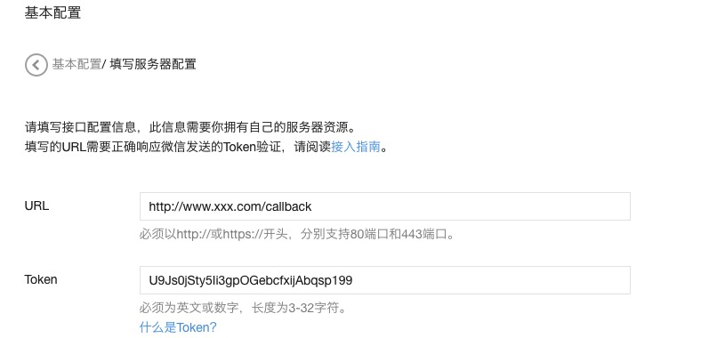

#微信处理对象

##一、简述

微信处理对象，主要是负责微信相关的操作。比如：

* 消息处理
* 时间处理
* 素材处理
* 授权处理
* 加密处理

> 注意：
> 
> 1、微信公众号区分订阅号和服务号类型，每种类型都可以做微信认证，因为不同的类型和认证情况，可以获取不同的公众号接口权限。因此，并非使用wechatgo，就能处理所有微信相关的操作，这取决于你的公众号所具备的API权限列表。
> 
> 2、举例来说，未做微信认证的订阅号，是无法获取图片素材并做本地存储的，另外，你也无法响应用户视频之类的消息。
> 
> 3、具体的API权限列表，需要等公众号后台查看。


##二、使用微信处理对象处理用户信息

微信处理对象处理用户信息，可以大致分为以下几种使用场景：

* 处理用户发送的消息
* 处理响应给用户的消息
* 获取微信公众号授权
* 获取用户信息
* 其他

具体处理：

①：导入包

```
import (
	"github.com/donghongshuai/gocircum/wechat"
)
```

设置微信公众号相关的配置——设置程序（并不需要全部都设置，取决于你的使用场景）

```
//实例化微信处理对象
wt := wechat.NewWechat()

//设置Token信息（必须，该信息可由公众号后台自由配置）
wt.Configure.Token = "U9Js0jSty5Ii3gpOGebcfxijAbqsp1Zr"

//设置AppId（必须，公众号后台查看）
wt.Configure.AppId = "wx02a6c7ac5b290076"

//设置AppSecret（必须，公众号后台查看)
wt.Configure.AppSecret = "4949f2099a76367634e22d39987b43c8"

//设置是否开启消息加密（非必须，默认为“明文模式”，如果公众号后台设置为“安全模式”，则此处必须设置为true)
wt.Configure.EnableMsssageEncrypt = true

//设置EncodingAESKey（非必须，公众号后台查看，可修改，wt.Configure.EnableMsssageEncrypt 设置为 true 时有效)
wt.Configure.EncodingAESKey = "4949f2099a76367634e22d39987b43c8"

//设置公众号消息接口的URI（非必须，默认为“/callback”，这样的话，公众号后台需要设置为如：http://www.xxx.com/callback）
//假如你需要自定义设置公众号消息回调地址，那么这里就要做同步修改了
wt.Configure.CallBackUri = "/callback"
```
设置微信公众号相关的配置——设置公众号后台 



代码说明：

```
// fasthttp server
func FastHttpServe() {

	//实例化一个web服务
	server := wechat.NewFastHttpServer()
	
	//实例化微信处理对象，然后设置公众号相关信息，如：Token、AppId、AppSecret等信息
	wt := wechat.NewWechat()
	wt.Configure.Token = "U9Js0jStxxxxxxxxfxijAbqsp199"
	wt.Configure.AppId = "wxeeewewewaaa1ce1"
	wt.Configure.AppSecret = "08766555b58bb27c34e5a8afcd65841b"
	
	//设置文本消息处理器，用户发送的文本消息，将由开发者自己定义的函数来处理
	wt.AddTextHandler(MyTextHandler)
	
	//设置图片消息处理器，用户发送的图片消息，由开发者自己定义的函数来处理
	wt.AddImgHandler(MyImageHandler)
	
	//设置短视频消息处理器
	wt.AddShortVideoHandler(MyShortVideoHandler)

	//绑定微信处理对象和web server
	server.HandleWechat(wt)
	
	//开始监听HTTP端口，对外服务
	server.Listen(":9898")
}
```

```
//文本消息处理器
//用户自定义的文本消息处理器，必须实现接口 wechat.MsgTextHandler，同理 图片处理器、
//短视频处理器等都要实现预定义的接口，以文本消息处理器为例，函数参数必须是微信的上下文
//对象指针：*wechat.WechatContext。函数的返回值必须是 interface类型。
func MyTextHandler(ctx *wechat.WechatContext) interface{} {
	//设置返回变量
	var res interface{}
	//获取微信公众号的access token信息
	accessToken, _, _ := wechat.WechatApp.GetAccessToken()
	//我们可以返回用户一个文本消息（你也可以返回News信息或图片，这取决于你自己，
	//但本例中，是以返回文本内容为例的，如果你要返回一个图片信息给用户，那可以这样写：
	//res := ctx.GetMsgImgResponse()）
	res := ctx.GetMsgTextResponse()
	//设置返回给用户的具体文本信息
	res.Content = "FastHttp：这是文字！！ accessToken：" + accessToken
	//返回数据（必须）
	return res
}
```


如果要做的是响应用户发给微信公众号消息的话，你仅仅需要做三个事情：

* 设置微信处理对象 wt
* 设置HTTP 服务对象 server ，并绑定微信处理对象
* 为微信处理对象，添加好你的消息处理器，比如上面例子中设置的文本消息处理器 MyTextHandler，专门用于处理用户发给微信的文本消息。你可以为一个微信处理对象，绑定多个不同的消息处理器。

对于只是想获取access token这种情况，更简单，实例化一个微信处理对象即可。后面我们会详细展示，具体说明。


